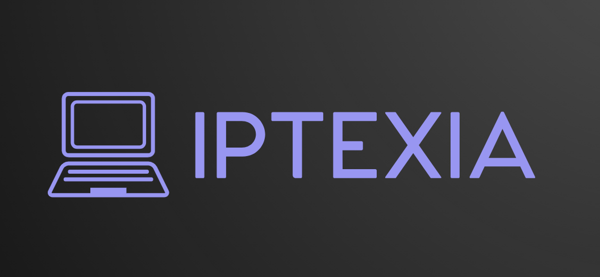

# 🔒 IPTEXIA: Intelligent Intellectual Property Protection Platform

<p align="center">
  
</p>

## 🌟 Project Overview

IPTEXIA is a revolutionary decentralized platform that leverages cutting-edge AI and blockchain technologies to protect, verify, license, and monitor intellectual property in the Web3 era. Our mission is to empower creators by providing a comprehensive, secure, and transparent solution for managing digital assets.

## 🚀 Core Features

### 1. 🔐 Decentralized IP Protection
- Secure, immutable storage across multiple decentralized networks
- Advanced encryption and blockchain timestamping
- Permanent and tamper-proof asset preservation

### 2. 🧠 AI-Powered Monitoring
- 24/7 neural network surveillance
- Global web scanning for potential IP violations
- Advanced content analysis and similarity detection
- Real-time threat identification

### 3. 📜 Smart Contract Licensing
- Automated royalty distribution
- Transparent and fair licensing mechanisms
- Customizable licensing templates
- Instant, trustless contract execution

### 4. 🌐 Comprehensive IP Management
- One-click IP registration
- Ownership verification and authentication
- Detailed licensing and usage tracking
- Reputation and credibility scoring system

## 🛠 Technology Stack

### Frontend
- **Framework**: Next.js 15
- **Language**: TypeScript
- **UI Library**: React
- **Styling**: Tailwind CSS
- **Animation**: Framer Motion

### Blockchain & Decentralization
- **Blockchain**: Polygon
- **Decentralized Storage**: 
  - Filecoin
  - IPFS
  - Storacha

### AI & Machine Learning
- Neural network-based content analysis
- Machine learning violation detection
- Advanced pattern recognition algorithms

### Additional Technologies
- Web3 Integration
- Smart Contract Development
- Cryptographic Security Protocols

## 📦 Prerequisites

- Node.js (v19+)
- npm or yarn
- Web3 Wallet (MetaMask recommended)
- Basic understanding of blockchain concepts

## 🔧 Installation & Setup

### 1. Clone the Repository
```bash
git clone https://github.com/yourusername/iptexia.git
cd iptexia
```

### 2. Install Dependencies
```bash
npm install
# or
yarn install
```

### 3. Environment Configuration
1. Create a `.env.local` file
2. Add the following environment variables:
```
NEXT_PUBLIC_BLOCKCHAIN_NETWORK=polygon_mainnet
NEXT_PUBLIC_INFURA_PROJECT_ID=your_infura_project_id
NEXT_PUBLIC_WALLET_CONNECT_PROJECT_ID=your_wallet_connect_project_id
```

### 4. Run Development Server
```bash
npm run dev
# or
yarn dev
```

## 🌐 Deployment

- Optimized for Vercel deployment
- Supports multiple blockchain networks
- Configurable through environment variables
- CI/CD pipeline ready

## 📂 Project Structure

```
ipchain/
├── app/                # Next.js app router pages
│   ├── about/
│   ├── dashboard/
│   ├── licenses/
│   ├── marketplace/
│   └── ...
├── components/         # Reusable React components
│   ├── dashboard/
│   ├── marketplace/
│   └── ui/
├── hooks/              # Custom React hooks
├── lib/                # Utility functions and helpers
├── public/             # Static assets
└── styles/             # Global styles
```

## 🤝 Contributing

1. Fork the repository
2. Create a feature branch (`git checkout -b feature/AmazingFeature`)
3. Commit your changes (`git commit -m 'Add some AmazingFeature'`)
4. Push to the branch (`git push origin feature/AmazingFeature`)
5. Open a Pull Request

### Contribution Guidelines
- Follow existing code style and conventions
- Write comprehensive tests for new features
- Update documentation accordingly
- Ensure code passes all lint and type checks

## � Project Statistics

- 🔒 500K+ Protected Digital Assets
- 💰 $10M+ Royalties Distributed
- 🎯 99.9% IP Violation Detection Accuracy

## �📄 License

Distributed under the MIT License. See `LICENSE` for more information.

## 🏆 Project Status

🟢 Active Development
- Continuous improvements
- Regular security updates
- Community-driven enhancements

## � Contact & Support

- **Project Website**: [https://iptexia.com](https://iptexia.com)
- **GitHub Repository**: [https://github.com/yourusername/iptexia](https://github.com/yourusername/iptexia)
- **Email**: support@iptexia.com

---

**Built with ❤️ for Creators, Powered by AI and Blockchain**

## 🌈 Acknowledgements

- Thanks to the open-source community
- Inspired by the potential of Web3 technologies
- Dedicated to protecting creative minds worldwide
